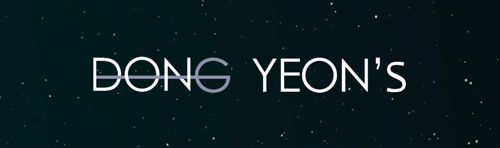

  

<h1 align="center">안녕하세요!</h1>

웹 프론트엔드 개발자를 꿈꾸는 김동연입니다.  
심플하지만 따뜻하게, 직관적이지만 감성적으로. 누구나 편히 사용할 수 있는 환경을 만드는 데 집중했습니다.

---

 ##  *
Portfolio
*

[📂 전체 포트폴리오 보기 (dothome)](http://kimdongyeon.dothome.co.kr/)

---

## 
🛠️ 진행한 프로젝트

### 
1. 📌 **한국동물구조관리협회**

> 공공기관리뉴얼웹사이트

- 사용 기술: HTML, CSS, JavaScript

- 주요 기능: 예약시스템 작성 ( mainpage )

- GitHub: [🔗 바로가기](https://kimdongyeon99.github.io/study310/project001/index_my.html)

- GitHubCODE: [🔗 바로가기]()

---

### 
2. 📌 **실바니안 패밀리**

> 제품중심신규웹사이트

- 사용 기술: HTML, CSS, JavaScript

- 주요 기능: 장바구니기능, 네이버API활용로그인 ( mainpage  + subpage2)

- GitHub: [🔗 바로가기](https://kimdongyeon99.github.io/study310/project002/index_001.html)

- GitHubCODE: [🔗 바로가기]()

---

### 
3. 📌 **인사이드 아웃**

> 인물형팬페이지

- 사용 기술: HTML, CSS, JavaScript

- 특징: 부드러운 스크롤 , ( mainpage  + subpage4)

- GitHub: [🔗 바로가기](https://kimdongyeon99.github.io/study310/project003/index_my.html)

- GitHubCODE: [🔗 바로가기]()

---

## 
👩‍💻 About Me

- 🔭 현재 웹디자인& 프론트엔드 공부 중!

- 🌱 UIUX 기획과 Html,Css,JavaScript 에 집중하고 있어요.

- 📫 연락: ehddus0820@gmail.com

---

## 
🧰 기술 스택

---

> 포트폴리오를 더 보고 싶다면 👉 [yourname.dothome.co.kr]() 방문해주세요!

